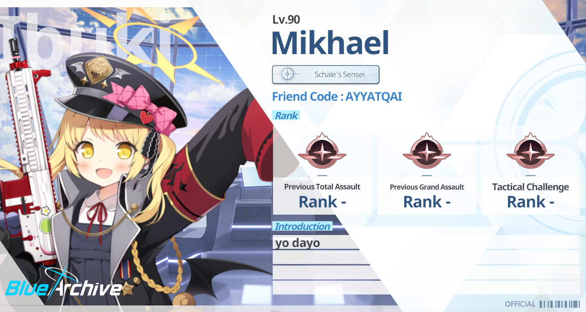

<h1 align="center">
  Hellooo!! ⸜(｡˃ ᵕ ˂ )⸝♡  
  My name is Barra Putra >:3
</h1>

<h3 align="center">
  A self-proclaimed web developer (mostly backend stuff). Currently learning Docker
  without setting my laptop on fire💔 Please don’t judge my empty profile, I swear I’m
  working on stuff (probably) (╥﹏╥)
</h3>

 

  
  <h3 align="center">
    Don't wander too far, you'll get bored fast with how empty my profile is!
  </h3>

 

  <h3 align="center">Languages and Tools:</h3>
  

    
    
    
    
    
    
    
    
    
    
    
    
    
    
    
    
    
    
    
    
  

  <h3 align="center">Connect with me:</h3>

  
  
  

  <h3 align="center">Also check out my Blue Archive account:</h3>
  

  

  
  

    "Emang kenapa cok? Emang kenapa hah?! Emang kenapa kalo Blue Archive?! Emang semua player Blue Archive itu udah pasti pedofil,
    hah?! Nggak cok! Gak ada player Blue Archive yang pedofil! Ada player Blue Archive menjadi guru teladan inspiratif, gitu! Kau masih ngekomenin ngetik-ngetik orang doang gitu kan, gara-gara dia main Blue Archive!"
  

